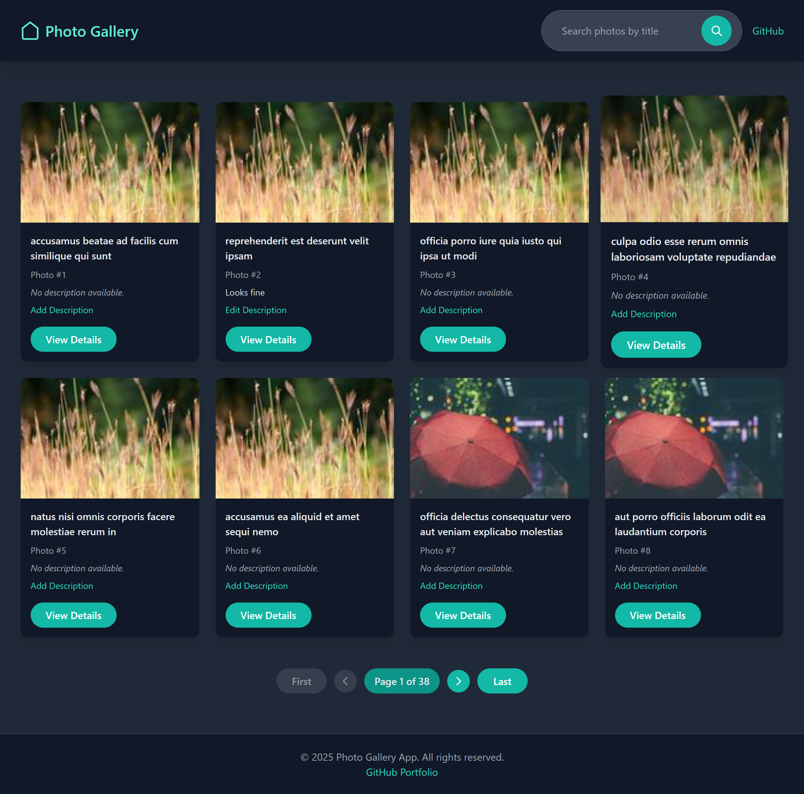
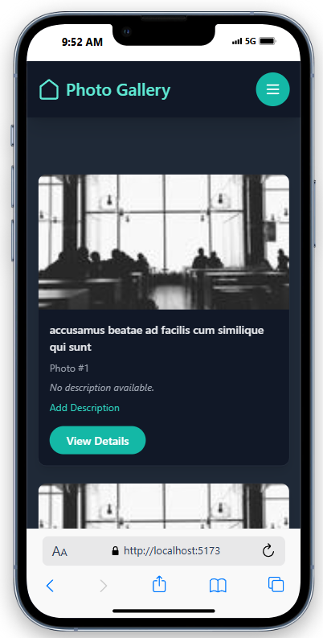
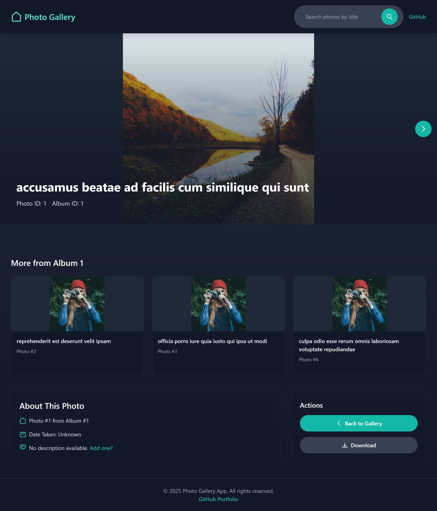
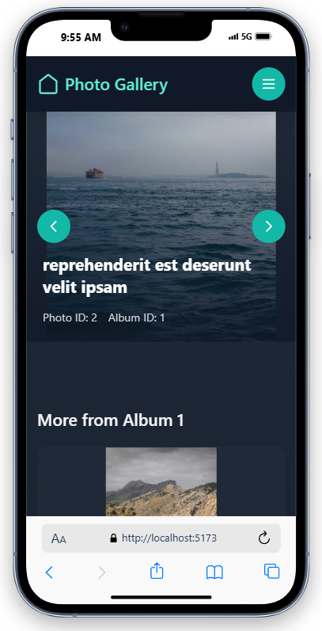

# Photo Gallery App

The Photo Gallery App is a modern, responsive web application built with React and Redux, designed to display and manage a collection of photos. It fetches photo data from the JSONPlaceholder API (5000 photos) and allows users to browse photos in a grid view, view detailed information about each photo, and add/edit descriptions. The app features a sleek dark theme with teal accents, consistent design across all interfaces, and a focus on usability and accessibility. This project was developed as part of the application for the Frontend Developer position at GrayCorp.

## Live Demo

You can view the live version of the Photo Gallery App here:

[Live Demo](https://jathuphotogalleryapp.netlify.app/)

## Setup Instructions

Follow these steps to set up and run the Photo Gallery App locally on your machine.

### Prerequisites

- **Node.js**: Version 14.x or higher (recommended: 18.x). Download it from [nodejs.org](https://nodejs.org/).
- **npm**: Version 6.x or higher (comes with Node.js). Alternatively, you can use Yarn if preferred.
- **Git**: Required to clone the repository. Install it from [git-scm.com](https://git-scm.com/).

### Installation

1. **Clone the Repository**:

   ```bash
   git clone https://github.com/your-username/PhotoGalleryNew.git
   cd PhotoGalleryNew
   ```

   Replace `your-username` with your GitHub username.

2. **Install Dependencies**:

   ```bash
   npm install
   ```

   This will install all required packages listed in `package.json`.

3. **Run the App**:
   ```bash
   npm run dev
   ```
   The app will start in development mode and open in your default browser at `http://localhost:5173` (or another port if 5173 is in use).

### Build for Production

To create a production-ready build:

```bash
npm run build
```

The output will be in the `dist` folder, which you can deploy to a hosting service (e.g., Netlify, Vercel).

### Troubleshooting

- If you encounter issues with `npm install`, ensure you’re using the recommended Node.js version (18.x). You can use a version manager like `nvm` to switch Node.js versions.
- If the app doesn’t start, check for error messages in the terminal and ensure all dependencies are installed correctly.
- Ensure your internet connection is active, as the app fetches data from the JSONPlaceholder API.

## Features

- **Photo Grid View**: Browse photos in a responsive grid layout with search and pagination (8 photos per page). Each card includes a "View Details" button for easy navigation to the photo’s details page. Fetches all 5000 photos from the JSONPlaceholder API.
- **Photo Details View**: View detailed information about each photo, including metadata (photo ID, album ID) and up to 3 related photos from the same album.
- **Description Editing**: Add and edit descriptions for photos directly from both the Gallery and Photo Details pages, with data persisted in `localStorage`.
- **Consistent Design**: Modern dark theme with teal accents, consistent card designs, and hover effects across all interfaces.
- **Responsive Layout**: Fully responsive design that works seamlessly on desktop and mobile devices.
- **Accessibility**: Keyboard navigation, focus states for interactive elements, and screen reader support.
- **Download Photos**: Download individual photos from the Photo Details page.
- **Error Handling**: Graceful handling of loading and error states with user-friendly messages (e.g., loading spinners, error messages with retry option).

## Screenshots

- **Gallery View (Desktop)**:  
  
- **Gallery View (Mobile)**:  
  
- **Photo Details View (Desktop)**:  
  
- **Photo Details View (Mobile)**:  
  

## Project Structure

```
PhotoGalleryNew/
├── public/                 # Static assets (e.g., favicon, index.html)
├── src/                    # Source code
│   ├── components/         # React components
│   │   ├── Gallery.jsx     # Gallery page component with photo grid and pagination
│   │   └── PhotoDetails.jsx # Photo Details page component with photo metadata
│   ├── features/           # Redux slices
│   │   └── photosSlice.js  # Redux slice for fetching and managing photo data
│   ├── App.jsx             # Main app component with routing and header
│   ├── App.css             # Global styles (Tailwind CSS)
│   ├── main.jsx            # Entry point for the React app
│   └── store.js            # Redux store configuration
├── screenshots/            # Screenshots for the README
├── README.md               # Project documentation
└── package.json            # Dependencies and scripts
```

## Technologies Used

- **React**: Frontend library for building user interfaces.
- **Redux Toolkit**: State management for fetching and storing photo data.
- **React Router**: Routing for navigation between Gallery and Photo Details pages.
- **Tailwind CSS**: Utility-first CSS framework for styling.
- **Framer Motion**: Animation library for smooth transitions and effects.
- **JSONPlaceholder API**: Public API for fetching photo data (provides 5000 photos).

## State Management

The Photo Gallery App uses **Redux Toolkit** for state management. This simplifies managing global state in the application. In this app:

- **Photos Data**: The app fetches photo data from the JSONPlaceholder API using a Redux thunk (`fetchPhotos`) in `photosSlice.js`. The fetched data is stored in the Redux store, making it accessible to both the Gallery and Photo Details components.
- **Loading and Error States**: The app manages loading and error states during API calls, ensuring a smooth user experience with appropriate feedback (e.g., loading spinners, error messages).
- **Centralized State**: The Redux store (`store.js`) centralizes the app’s state, allowing components to access and update photo data efficiently using `useSelector` and `useDispatch` hooks.

This approach ensures that the app’s state is predictable, scalable, and easy to debug.

## Future Improvements

- **Backend Integration**: Add a backend (e.g., Node.js with Express) to store descriptions persistently in a database instead of `localStorage`.
- **User Authentication**: Allow users to log in and manage their own photo collections.
- **Advanced Search**: Implement filters (e.g., by album ID) and sorting options for better photo browsing.
- **Photo Upload**: Enable users to upload their own photos to the gallery.
- **Improved Accessibility**: Add ARIA labels and conduct a full accessibility audit to enhance support for assistive technologies.

## Submission Details

This project is submitted as part of the application for the **Frontend Developer** position at **GrayCorp**. The GitHub repository for this project can be found at:

[GitHub Repository](https://github.com/Arun-Jathu/PhotoGalleryNew)

A live demo of the app is available at:

[Live Demo](https://jathuphotogalleryapp.netlify.app/)

For any questions, please contact me at [arunjathu0@gmail.com].

**Submitted to:** careers@graycorp.io
